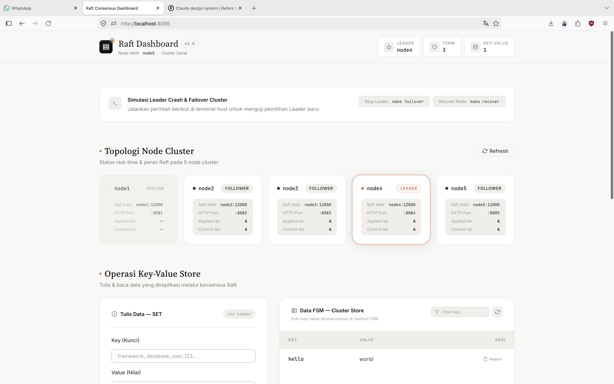
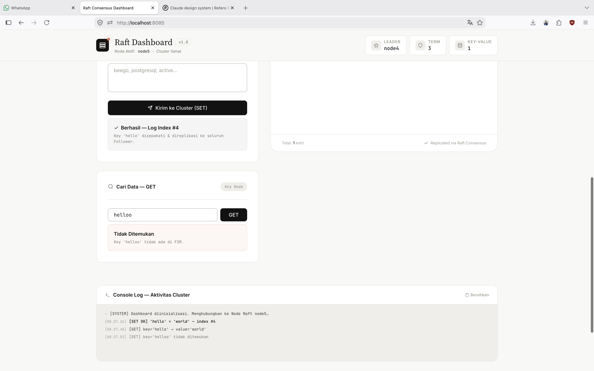

# Distributed Key-Value Store dengan Raft Consensus (Go + Docker Compose)

Repositori ini berisi implementasi *distributed replicated key-value store* menggunakan algoritma konsensus **Raft** via pustaka `hashicorp/raft` di bahasa pemrograman Go, yang dijalankan di atas **5-Node Cluster** Docker Compose (Skala Menengah - Besar).

---

## Dashboard UI

Monitoring dashboard real-time untuk memantau status cluster, topologi node, dan operasi key-value store — dibangun dengan Go HTML template.

| Cluster Topology & Node Status | KV Operations & Console Log |
|:---:|:---:|
|  |  |

> Dashboard dapat diakses di `http://localhost:808{1-5}` setelah cluster berjalan.

---

## 1. Konsep Inti Algoritma Raft

Raft adalah algoritma konsensus yang dirancang agar mudah dipahami (*understandable*) guna mengelola replikasi log pada sistem terdistribusi.

### A. Tiga State Server
Setiap node dalam cluster selalu berada di salah satu dari tiga status:
1. **Follower**: Menjadi pendengar pasif. Menerima *heartbeat* dan replikasi log dari Leader.
2. **Candidate**: Status sementara ketika follower mengalami *election timeout*, menaikkan nilai Term, dan meminta suara untuk menjadi Leader baru.
3. **Leader**: Satu-satunya node yang berhak melayani permintaan penulisan data (*write requests*), mengatur replikasi log ke seluruh follower, serta mengirim *heartbeat* periodik.

### B. Term (Logical Clock)
* Dalam sistem terdistribusi, jam fisik (*wall-clock time*) tidak dapat dipercaya karena rentan terhadap *clock drift*.
* Raft menggunakan **Term**, yaitu bilangan bulat yang selalu bertambah (*monotonically increasing*: 1, 2, 3, ...).
* Term berfungsi sebagai jam logis (*logical clock*) untuk menentukan keabsahan dan urutan kronologis. Node dengan nomor Term yang lebih tinggi selalu memiliki otoritas lebih sah dibanding node dengan Term yang lebih rendah (*stale*).

---

## 2. Penjelasan Mendalam: Mengapa Harus Jumlah Ganjil?

### A. Konsep Kuorum Mayoritas Mutlak

Di Raft, tidak ada satu node pun yang boleh membuat keputusan sepihak. Keputusan pemilihan Leader atau penulisan data **wajib disetujui oleh mayoritas mutlak (> 50%)**.

$$\text{Quorum} = \left\lfloor \frac{N}{2} \right\rfloor + 1$$

---

### B. Perbandingan Langsung: Cluster 3 Node vs 4 Node

Perhatikan tabel perbandingan di bawah ini untuk memahami mengapa menambah node dari 3 menjadi 4 **tidak berguna bagi toleransi kegagalan**:

| Parameter | Cluster 3 Node (Ganjil) | Cluster 4 Node (Genap) |
| :--- | :--- | :--- |
| **Total Node ($N$)** | **3** | **4** |
| **Kuorum Mayoritas Mutlak** | $\lfloor 3/2 \rfloor + 1 = \mathbf{2 \text{ Node}}$ | $\lfloor 4/2 \rfloor + 1 = \mathbf{3 \text{ Node}}$ |
| **Maksimal Node Boleh Mati ($F$)** | $3 - 2 = \mathbf{1 \text{ Node}}$ | $4 - 3 = \mathbf{1 \text{ Node}}$ |
| **Jika 1 Node Mati** | Sisa 2 node $\rightarrow$ Masih capai kuorum (2 $\ge$ 2) $\rightarrow$ **SELAMAT** | Sisa 3 node $\rightarrow$ Masih capai kuorum (3 $\ge$ 3) $\rightarrow$ **SELAMAT** |
| **Jika 2 Node Mati** | Sisa 1 node $\rightarrow$ Gagal kuorum (1 < 2) $\rightarrow$ **LUMPUH** | Sisa 2 node $\rightarrow$ Gagal kuorum (2 < 3) $\rightarrow$ **LUMPUH** |

> [!IMPORTANT]
> **Kesimpulan Kritis**:
> Baik Cluster 3 Node maupun 4 Node **SAMA-SAMA HANYA MENTOLERANSI 1 NODE MATI**!
> Menambahkan node ke-4 **tidak menambah daya tahan cluster**, tetapi justru:
> 1. Membuang biaya 1 server tambahan.
> 2. Menambah overhead latensi jaringan RPC.
> 3. Meningkatkan peluang kerusakan hardware (karena jumlah server bertambah).

---

### C. Bahaya *Network Partition* (Keterbelahan Jaringan) pada Jumlah Genap

Misalkan terjadi kebocoran/pemutusan jaringan yang membelah cluster menjadi dua bagian sama besar:

#### Skenario Cluster 4 Node (Split 2 vs 2):
- **Sisi Kiri**: Node 1, Node 2 (2 Node)
- **Sisi Kanan**: Node 3, Node 4 (2 Node)
- Kuorum yang dibutuhkan = **3 Node**.
- Sisi Kiri hanya ada 2 node (2 < 3) $\rightarrow$ **Tidak bisa pilih Leader**.
- Sisi Kanan hanya ada 2 node (2 < 3) $\rightarrow$ **Tidak bisa pilih Leader**.
- **Hasil**: **CLUSTER MATI TOTAL (*Outage*)** meskipun seluruh 4 node dalam kondisi hidup sehat!

#### Skenario Cluster 5 Node (Split 3 vs 2):
- **Sisi Kiri**: Node 1, Node 2, Node 3 (3 Node)
- **Sisi Kanan**: Node 4, Node 5 (2 Node)
- Kuorum yang dibutuhkan = **3 Node**.
- Sisi Kiri memiliki 3 node (3 $\ge$ 3) $\rightarrow$ **BERHASIL memilih Leader & Aplikasi Tetap Normal!**
- Sisi Kanan hanya ada 2 node (2 < 3) $\rightarrow$ Menolak transaksi secara aman.
- **Hasil**: **SISTEM TETAP HIDUP**.

---

### D. Tabel Ringkasan Fault Tolerance

| Total Node ($N$) | Kuorum Mayoritas | Maksimal Node Mati ($F$) | Persentase Toleransi | Evaluasi Rekomendasi |
| :---: | :---: | :---: | :---: | :--- |
| **1** | 1 | **0** | 0% | *Single Point of Failure*. |
| **2** | 2 | **0** | 0% | Jika 1 node mati $\rightarrow$ Cluster Lumpuh. |
| **3** | **2** | **1** | **33.3%** | **Sangat Baik** (Minimum Skala Kecil). |
| **4** | 3 | **1** | 25% | **Sangat Buruk** (Rugi biaya & rawan split-brain). |
| **5** | **3** | **2** | **40%** | **Sangat Baik** (Skala Menengah - Besar). |
| **6** | 4 | **2** | 33.3% | Buruk (Rugi biaya & tidak efisien). |
| **7** | **4** | **3** | **42.8%** | **Sangat Baik** (Skala Enterprise / High-Availability Tinggi). |

---

## 3. Struktur Proyek

```text
.
├── Dockerfile
├── Makefile
├── compose.yaml
├── go.mod
├── go.sum
├── main.go
└── README.md
```

---

## 4. Port & Pemetaan Service 5-Node Cluster

Cluster disetup menggunakan 5 kontainer pada `compose.yaml`:

* **Node 1 (Initial Leader)**: HTTP `8081`, Raft TCP `12000`
* **Node 2 (Follower)**: HTTP `8082`, Raft TCP `12000`
* **Node 3 (Follower)**: HTTP `8083`, Raft TCP `12000`
* **Node 4 (Follower)**: HTTP `8084`, Raft TCP `12000`
* **Node 5 (Follower)**: HTTP `8085`, Raft TCP `12000`

---

## 5. Cara Menjalankan & Perintah Operasional

```bash
# Menyalakan seluruh 5 node cluster
make up

# Memeriksa status seluruh 5 node
make status

# Mengirim request penulisan data ke Leader
make set KEY=cluster_size VALUE=5_nodes

# Membaca data dari seluruh Follower (Node 2 - Node 5)
make get KEY=cluster_size

# Simulasi Leader Failover (matikan node1)
make failover

# Memulihkan node1
make recover

# Menghentikan cluster
make down
```
